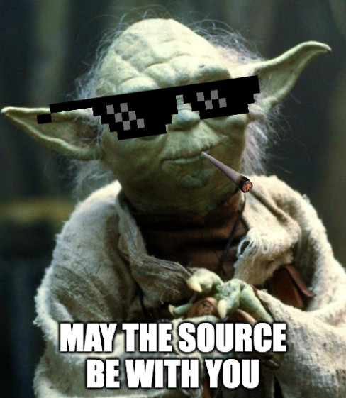

### Abstract
Join me in twisting and bending the snake to our will! In this talk, we'll solve a number of programming challenges leveraging nothing but the tools available with a fresh installation of Python: builtins and standard libraries. I will try to illustrate how some of my favorite "basic tools" can really shine and save a lot of work, while simultaneously producing beautiful idiomatic code. Mastering these tools lies in the path to become one with the snake.

The motivation for this topic is that sometimes (too many times?) during our work we reach for third-party libraries, or worse yet, implement our own flaky solutions, when we can easily solve the problem at hand using the tools provided by the language itself. Experienced Pythonistas may already be familiar with many of these things, but hopefully there'll be something for everyone to learn. Plus you can see me fail miserably at live coding. Whatever can go wrong?

### Prerequisites
Attendees should be comfortable with basic syntax (`if`, `for`, `def`, `import`) and types (`list`, `dict`, `set`).

### Introduction
This talk is meant to showcase and expand the audience's knowledge of Python builtins and stdlib.

It should help us get from this point... 


```python
def argmax1(values):
    i_max = 0
    i = 1
    while i < len(values):
        if values[i] > values[i_max]:
            i_max = i
        i += 1
    return i_max
```
---

to this point...


```python
def argmax2(values):
    i_max = 0
    for i, value in enumerate(values):
        if value > values[i_max]:
            i_max = i
    return i_max
```
---

and hopefully end up somewhere around this point...


```python
def argmax3(values):
    indices = range(len(values))
    return max(indices, key=lambda i: values[i])
```

### Lists, comprehensions, and generators

See `lists_comprehensions_generators.py`.


### Long live the Resistance!
A very important message was delivered to us! The knowledge therein may greatly strengthen our cause against the Galactic Empire. However, for security reasons, the message was hidden among a number of random messages, and its contents are encrypted. Our mission is to find the correct message, decrypt it, and strike back at the Empire!

In addition to the message files, we also know the encryption algorithm and a few details about the message which should help us identify it. Each character is represented as a 3-dimensional vector, where the first two axes represent the character's position in the message text, and the z-axis contains the character's numeric code. The mapping of characters to numeric codes is stored together with the vectors. For additional security, the message is mixed in with noise: for each `(x, y)` position in the original message there are a number (its "noise ratio") of additional noise vectors. 

* The message data (i.e. payload *and* noise) has no zero vector.
* The message's noise ratio is 10.
* The vector in the message payload closest to `(10, 20, 30)` is `(10, 20, 47)`.
* The message's checksum is 12627. The checksum can be obtained by multiplying the components of each vector in the payload, then adding together those products, and finally getting the remainder of integer division by the size of the payload.


