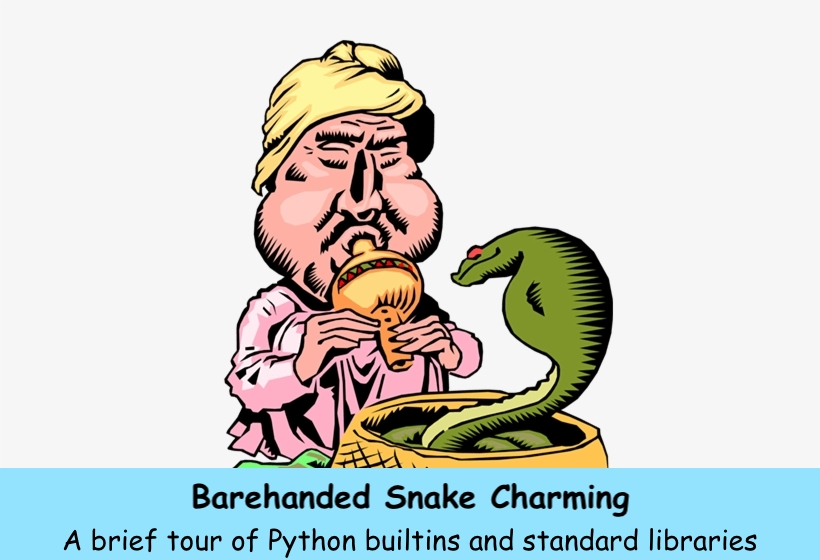

### Abstract
Join me in twisting and bending the snake to our will! In this talk, we'll solve a number of programming challenges leveraging nothing but the tools available with a fresh installation of Python: builtins and standard libraries. I will try to illustrate how some of my favorite "basic tools" can really shine and save a lot of work, while simultaneously producing beautiful idiomatic code. Mastering these tools lies in the path to become one with the snake.

The motivation for this topic is that sometimes (too many times?) during our work we reach for third-party libraries, or worse yet, implement our own flaky solutions, when we can easily solve the problem at hand using the tools provided by the language itself. Experienced Pythonistas may already be familiar with many of these things, but hopefully there'll be something for everyone to learn. Plus you can see me fail miserably at live coding. Whatever can go wrong?

### Prerequisites
Attendees should be comfortable with basic syntax (`if`, `for`, `def`, `import`) and types (`list`, `dict`, `set`).

### Outline
1. https://projecteuler.net/problem=4
2. https://pythonprinciples.com/challenges/Capital-indexes/
3. https://pythonprinciples.com/challenges/Double-letters/
4. https://pythonprinciples.com/challenges/All-equal/
5. https://pythonprinciples.com/challenges/Flatten-a-list/
6. https://pythonprinciples.com/challenges/Minmaxing/
7. https://pythonprinciples.com/challenges/Anagrams/

### Notes
- https://www.youtube.com/watch?v=lyDLAutA88s&ab_channel=PyData
  - pathlib, itertools, collections, dataclasses?, re?
  - any(), all(), map(), range(), enumerate(), reversed()
  - generators, generator expressions, comprehensions
  - set, collections.deque, collections.Counter

  - use sample problems from Codin'Game's clash of code (can create a private clash and share URL during the talk)
  - use problems from project euler?
  - mention the time that a candidate installed an external dependency to compute something like the max of two numbers
